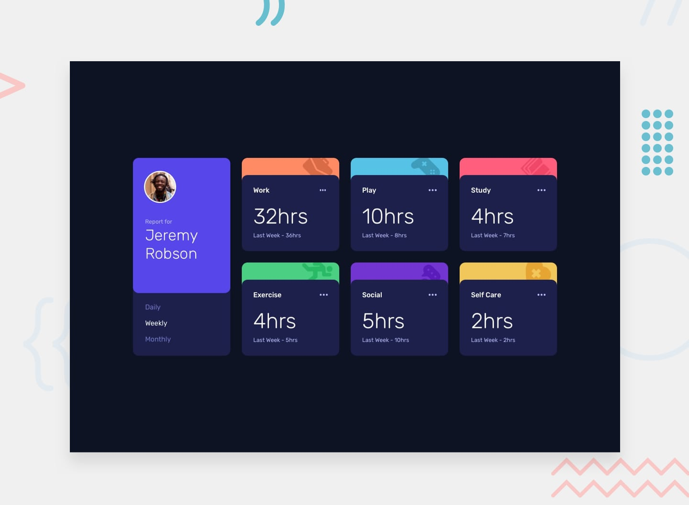

# Time Tracking Dashboard

Responsive dashboard showing time spent on activities with daily / weekly / monthly views.
Solution to a [Frontend Mentor](https://www.frontendmentor.io) challenge.

**Live demo:** https://kortlish.github.io/Time-Tracking-Dashboard/



## What I did
- Semantic HTML and a responsive layout (mobile → desktop) written in **SCSS**
- **JavaScript** that loads data from `data.json` and switches the view between daily, weekly and monthly
- Build pipeline in **Gulp**: Sass compilation, PostCSS + cssnano (minification), Terser (JS), BrowserSync

## Run locally
```bash
npm install
npx gulp
```
